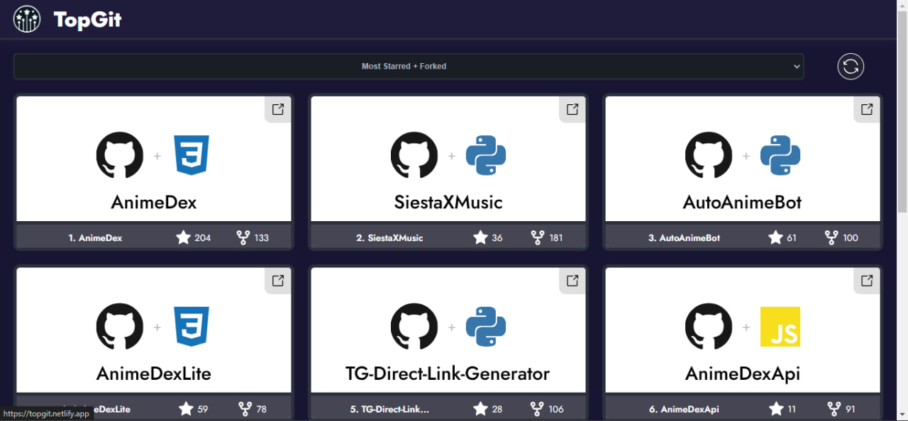

# Welcome to TopGit! 🚀

---

Discover the Best of GitHub with TopGit! Explore, analyze, and share the top repositories on GitHub with ease. Whether you want to showcase your best projects or find inspiration from others, TopGit makes it simple and fun.

## What Can You Do with TopGit?

- ⭐ **View Your Top Repositories:** Discover your most starred and most forked projects.
- 🍴 **Explore Others' Best Repositories:** Check out the top repositories of any GitHub user.
- 📈 **Get Insights:** Analyze and compare repositories based on stars and forks.

## How It Works

1. **Enter a GitHub Username:** Type in your username or any other GitHub username to explore their top repositories.
2. **Select the Criteria:** Choose whether you want to see the most starred, most forked, or a combination of both.
3. **Explore and Share:** Browse through the top repositories and share your favorites with friends or the community.

## Rate Limit

⚠️ **Note:** You can check only up to 60 users per hour due to GitHub API rate limits. Plan your searches accordingly!

## Try It Out! 🌟

Discover the best of GitHub now at [TopGit](https://topgit.netlify.app).

Curious about my top repositories? [Check them out here](https://topgit.netlify.app/?user=TechShreyash).

## Get Started!

Ready to explore the top GitHub repositories? Enter a GitHub username in the search box above and start discovering the best projects on GitHub today! 🎉
